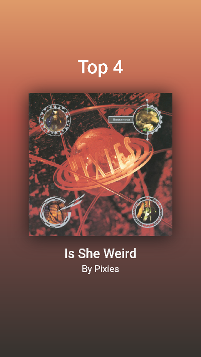

# SOTD-GENERATOR 🧙‍♂️

## What?

This is a tool to generate cool instagram story sized graphics for song tops and highlights.

## How?

The tool produces your graphic through the following steps:
* Searches for the song using the Spotify API
* Downloads the album art
* Performs color preprocessing ([changes color space](https://en.wikipedia.org/wiki/Color_space))
* Performs K-Means clustering to find dominant colors
* Generates a graphic using a gradient of dominant colors and the album art
* Screenshots from a headless browser

## Why?

It's cool. Check out the results:

```
Top number: 15
Search track: Weird Fishes
```


```
Top number: 4
Search track: Is She Weird Pixies
```


## Requirements

```
pyppeteer
spotipy
io
os
asyncio
json
requests
sklearn
numpy
pillow
matplotlib
```

### Additional requirements

* `pyppeteer` (Python [Puppeteer](https://pptr.dev/) port) requires a chrommium browser to be installed.
* Perform setup of a Spotify application to access the API. See [Spotify for Developers](https://developer.spotify.com/dashboard/applications).
* Update `spotify_credentials.json` with your own credentials.

## Notes

* You can change the number of dominant colors and gradient structure by editing `n_colors` and the css file in `assets` respectively.
* You can edit the HTML file freely
* This project is very personal and it might not be suited as a general purpose tool as of now.

## TODO

* Better CLI (it sucks right now ☠)
* Non-hardcoded gradient
* Better color preprocessing
* Better way of generating the image from the HTML
